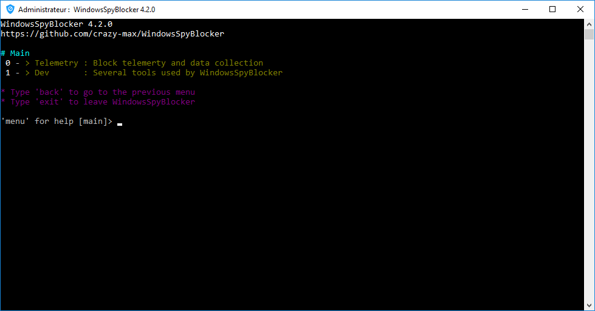

  
  
  
  
  
  

## About

**WindowsSpyBlocker** :shield: is an application written in [Go](https://golang.org/) and delivered as a [single executable](https://github.com/crazy-max/WindowsSpyBlocker/releases/latest) to block spying and tracking on Windows systems :no_entry:.

The approach of this project is to capture and interpret network traffic :vertical_traffic_light: based on a set of tools. Depending on the interactions :chains: between services and source or destination of traffic, rules are created and sorted by assignment.

> Main window of WindowsSpyBlocker

Configuration file `app.conf` is generated at first launch :

For more info, take a look at [Wiki](../../wiki).

## Telemetry and data collection

To capture and interpret network traffic for (telemetry option), QEMU virtual machines are used on the server virtualization management platform [Proxmox VE](https://www.proxmox.com/en/) based on :

* Windows 10 Pro 64bits (+ Microsoft Office 2019) with automatic updates enabled.
* Windows 8.1 Pro 64bits with automatic updates enabled.
* Windows 7 SP1 Pro 64bits with automatic updates enabled.

Traffic dumps are clean every day and compared with the current rules to add / remove some hosts or firewall rules.

Tools used to capture traffic :

* `qemu -net dump` : capture
* [Wireshark](../../wiki/appDevWireshark) : capture + logs
* [Sysmon](../../wiki/appDevSysmon) : capture + logs
* [Proxifier](../../wiki/devProxifier) : logs

The `data` folder contains the blocking rules based on domains or IPs detected during the capture process :

* `data/<type>/extra.txt` : Block third party applications (Skype, Bing, Live, Outlook, NCSI, etc.)
* `data/<type>/spy.txt` : Block Windows Spy / Telemetry
* `data/<type>/update.txt` : Block Windows Update

[Firewall](../../wiki/dataFirewall) and [Hosts](../../wiki/dataHosts) data are the main types. The others are generated from these as :

* [DNSCrypt](../../wiki/dataDNSCrypt) : a protocol for securing communications between a client and a DNS resolver.
* [OpenWrt](../../wiki/dataOpenWrt) : an open source project used on embedded devices to route network traffic.
* [P2P](../../wiki/dataP2P) : a plaintext IP data format from PeerGuardian.
* [Proxifier](../../wiki/dataProxifier) : an advanced proxy client on Windows with a flexible rule system.
* [simplewall](../../wiki/dataSimplewall) : a simple tool to configure Windows Filtering Platform (WFP).

And about data collection, you can read the [Telemetry collection](../../wiki/miscTelemetry) page for more info.

## Projects using WindowsSpyBlocker

* [BlackArch Linux](https://www.blackarch.org/) : an Arch Linux-based penetration testing distribution for penetration testers and security researchers.
* [Blackweb](https://github.com/maravento/blackweb) : URLs Blacklist for Squid
* [BlahDNS](https://blahdns.com/) : A small hobby ads block dns project with doh, dot, dnscrypt support.
* [DNSCrypt Proxy](https://dnscrypt.info/) : A flexible DNS proxy, with support for encrypted DNS protocols.
* [Energized Protection](https://energized.pro/) : Let's make an annoyance free, better open internet, altogether!
* [FilterLists](https://filterlists.com/) : An independent, comprehensive directory of filter and host lists for advertisements, trackers, malware, and annoyances.
* [LEDE Project](https://lede-project.org/) : A Linux operating system based on OpenWrt.
* [Mikrotik hosts parser](https://github.com/tarampampam/mikrotik-hosts-parser) : An application that blocks "advertising" for routers based on RouterOS.
* [OpenWrt adblock package](https://github.com/openwrt/packages/tree/master/net/adblock/files) : DNS based ad/abuse domain blocking
* [OPNsense](https://opnsense.org) : An open source, easy-to-use and easy-to-build HardenedBSD based firewall and routing platform.
* [pi-hole](https://pi-hole.net/) : A black hole for Internet advertisements (designed for Raspberry Pi).
* [simplewall](https://github.com/henrypp/simplewall) : Simple tool to configure Windows Filtering Platform (WFP).
* [void-zones-tools](https://github.com/cyclaero/void-zones-tools) : A list of void zones that can be readily feed into Unbound on FreeBSD.
* [WPD](https://getwpd.com/) : Customize Group Policy, Services and Tasks, responsible for data collection and sending, as you like.

## How can I help ?

All kinds of contributions are welcome :raised_hands:! 
The most basic way to show your support is to star :star2: the project, or to raise issues :speech_balloon: 
But we're not gonna lie to each other, I'd rather you buy me a beer or two :beers:!

## License

MIT. See `LICENSE` for more details. 
Icon credit to [Icons8](https://icons8.com/).
