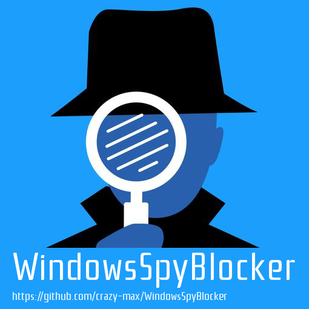

# Windows Spy Blocker 

Rules to block Windows spy / telemetry. 
I use Wireshark to make these rules every Windows Update on a virtual machine (Windows 10 Pro 64bits).

## Usage

### Hosts

* `hostsBlockWindowsSpy.txt` : Block Windows Spy / Telemetry
* `hostsBlockWindowsUpdate.txt` : Block Windows Update
* `hostsBlockWindowsExtra.txt` : Block third party applications

Copy / paste the content of the above files in your Windows hosts file located in `C:\Windows\System32\drivers\etc\hosts`. 

You can use the [HostsMan](http://www.abelhadigital.com/hostsman) freeware to keep update your hosts file. 
I have created a git hook to publish the hosts files to my personal website :
* [http://www.crazyws.fr/hostsBlockWindowsSpy.txt](http://www.crazyws.fr/hostsBlockWindowsSpy.txt)
* [http://www.crazyws.fr/hostsBlockWindowsUpdate.txt](http://www.crazyws.fr/hostsBlockWindowsUpdate.txt)
* [http://www.crazyws.fr/hostsBlockWindowsExtra.txt](http://www.crazyws.fr/hostsBlockWindowsExtra.txt)

### Firewall

Download and execute `firewallBlockWindowsSpy.bat` 
This script will download the latest `firewallBlockWindowsSpy.txt` containing ip addresses to block and add outbound firewall rules :

### Proxifier

Some hosts are not blocked and required a top level application. 
For example you can use [Proxifier](https://www.proxifier.com/) software to block Microsoft spy. 
Copy the content of the proxifier files in the repository in a blocked rule :

## Changelog

See `CHANGELOG.md`.

## License

LGPL. See `LICENSE` for more details. 
Icon credit to DWS.
