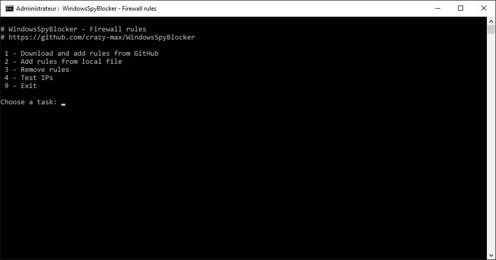

# Windows Spy Blocker 

Rules to block Windows spy / telemetry. 
I use Wireshark to make these rules every Windows Update on a virtual machine (Windows 10 Pro 64bits).

<!-- START doctoc generated TOC please keep comment here to allow auto update -->
<!-- DON'T EDIT THIS SECTION, INSTEAD RE-RUN doctoc TO UPDATE -->

- [Usage](#usage)
  - [Hosts](#hosts)
  - [Firewall](#firewall)
  - [Proxifier](#proxifier)
- [Changelog](#changelog)
- [License](#license)

<!-- END doctoc generated TOC please keep comment here to allow auto update -->

## Usage

### Hosts

* `hostsBlockWindowsSpy.txt` : Block Windows Spy / Telemetry
* `hostsBlockWindowsUpdate.txt` : Block Windows Update
* `hostsBlockWindowsExtra.txt` : Block third party applications

Copy / paste the content of the above files in your Windows hosts file located in `C:\Windows\System32\drivers\etc\hosts`. 

You can use the [HostsMan](http://www.abelhadigital.com/hostsman) freeware to keep update your hosts file. 
I have created a git hook to publish the hosts files to my personal website :
* [http://www.crazyws.fr/hostsBlockWindowsSpy.txt](http://www.crazyws.fr/hostsBlockWindowsSpy.txt)
* [http://www.crazyws.fr/hostsBlockWindowsUpdate.txt](http://www.crazyws.fr/hostsBlockWindowsUpdate.txt)
* [http://www.crazyws.fr/hostsBlockWindowsExtra.txt](http://www.crazyws.fr/hostsBlockWindowsExtra.txt)

### Firewall

Some queries use IP addresses but you can stop them with your Firewall. 
All relative information about these IP addresses are listed in the CSV file [firewallTestIPs.csv](https://raw.githubusercontent.com/crazy-max/WindowsSpyBlocker/master/firewall/firewallTestIPs.csv). 
[Download](https://github.com/crazy-max/WindowsSpyBlocker/archive/master.zip) or clone the repository, execute `firewall\firewallBlockWindowsSpy.bat` and choose an option : 

IPs are added in the Windows Firewall as outbound rules : 

### Proxifier

Some hosts are not blocked and required a top level application. 
For example you can use [Proxifier](https://www.proxifier.com/) software to block Microsoft spy. 
Copy the content of the proxifier files in the repository in a blocked rule :

## Changelog

See `CHANGELOG.md`.

## License

LGPL. See `LICENSE` for more details. 
Icon credit to DWS.
