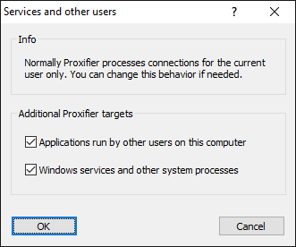
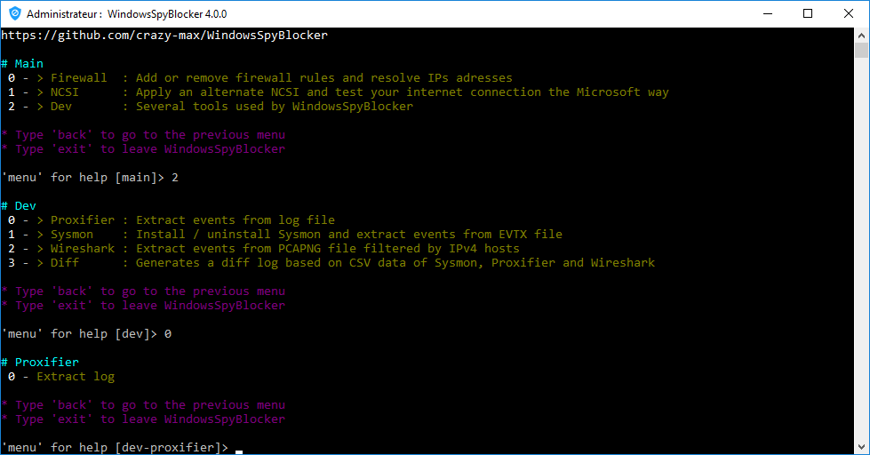

# Dev - Proxifier

## About

**Proxifier** is an advanced proxy client.

* https://www.proxifier.com/

## Capture

To capture / log traffic with this application, you will have to enable verbose and traffic log file:


> Log > File Log > Verbose and Traffic

Then you have to allow capture of services and applications run by other users :



> Profile > Advanced > Services and Other Users...

The log will be available by default in `C:\Users\<username>\Proxifier\Log.txt`<br />
Logs will look like :

```
[2016.05.29 02:48:49]
[2016.05.29 02:48:49]     Welcome to Proxifier v3.29
[2016.05.29 02:48:49]
[2016.05.29 02:48:49] Verbose output enabled.
[2016.05.29 02:48:49] Log file enabled C:\Users\<username>\Documents\Proxifier\Log.txt
[2016.05.29 02:48:49] Traffic log enabled C:\Users\<username>\Documents\Proxifier\Traffic\
[2016.05.29 02:49:04] svchost.exe (820, System) *64 - resolve win10.ipv6.microsoft.com. : DNS
[2016.05.29 02:49:14] svchost.exe (820, System) *64 - resolve sls.update.microsoft.com : DNS
[2016.05.29 02:49:14] svchost.exe (820) *64 - sls.update.microsoft.com:443 matching Default rule : direct connection
[2016.05.29 02:49:15] svchost.exe (820, System) *64 - resolve sls.update.microsoft.com : DNS
[2016.05.29 02:49:15] svchost.exe (820) *64 - sls.update.microsoft.com:443 matching Default rule : direct connection
[2016.05.29 02:49:15] svchost.exe (1352, System) *64 - resolve v10.vortex-win.data.microsoft.com : DNS
[2016.05.29 02:49:15] svchost.exe (1352, System) *64 - v10.vortex-win.data.microsoft.com:443 matching Default rule : direct connection
[2016.05.29 02:49:16] svchost.exe (820, System) *64 - resolve login.live.com : DNS
[2016.05.29 02:49:16] svchost.exe (820) *64 - login.live.com:80 matching Default rule : direct connection
[2016.05.29 02:49:16] svchost.exe (820, System) *64 - resolve login.live.com : DNS
[2016.05.29 02:49:16] svchost.exe (820) *64 - login.live.com:443 matching Default rule : direct connection
[2016.05.29 02:49:17] svchost.exe (820, System) *64 - resolve fe3.delivery.mp.microsoft.com : DNS
[2016.05.29 02:49:17] svchost.exe (820) *64 - fe3.delivery.mp.microsoft.com:443 matching Default rule : direct connection
[2016.05.29 02:49:21] svchost.exe (820, System) *64 - resolve login.live.com : DNS
```

## Parsing

WindowsSpyBlocker can be used to parse logs and generate CSV files.<br />
Before executing the script, do not forget to edit the `app.conf` file.

* **proxifier**
  * **logPath**: Path to Proxifier log file (replace `<username>`).
* **exclude**
  * **ips**: exclude IPs addresses from parsing. Ranges are allowed and in most cases you have to exclude your local network.
  * **hosts**: exclude domains from parsing. Wildcard are allowed and in most cases you have to exclude your local network.
  * **orgs**: exclude by whois organization from parsing. Wildcard are allowed and in most cases you have to exclude your ISP.

Then launch `WindowsSpyBlocker.exe` and select `Dev > Proxifier > Extract log` :



CSV files will be generated in `logs/` folder :

* `proxifier-all.csv`
* `proxifier-hosts-count.csv`
* `proxifier-unique.csv`
