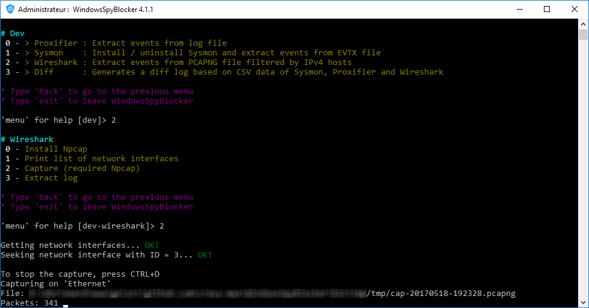
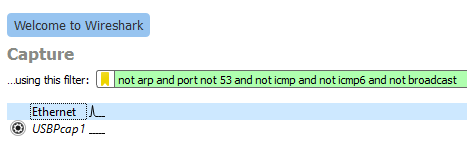

# Dev - Wireshark

## About

**Wireshark** is the well known network protocol analyzer. [Visual C++ Redistributable Packages for Visual Studio 2013](https://www.microsoft.com/en-us/download/details.aspx?id=40784) is required to capture and list network devices.

* https://www.wireshark.org/

## Capture

### Via WindowsSpyBlocker

WindowsSpyBlocker can be used to capture traffic on your network interface.<br />
A lite version of Wireshark is used through the WindowsSpyBlocker executable (see [wireshark.go](https://github.com/crazy-max/WindowsSpyBlocker/blob/master/app/cmds/dev/wireshark/wireshark.go#L63-L75) for more info).<br />
Before executing the script, do not forget to edit the `app.conf` file.

* **wireshark**
  * **capture**
    * **interface**: idx of interface used by Wireshark
    * **filter**: packet filter in libpcap filter syntax

The idx of the interface can be found be launching `WindowsSpyBlocker.exe` and select `Dev > Wireshark > Print list of network interfaces` :


Then go to `Dev > Wireshark > Capture` to capture packets :



### Via Wireshark GUI

To capture / log traffic with this application, you will have to select the correct adapter and enter a filter :


> Filter: `not arp and port not 53 and not icmp and not icmp6 and not broadcast`<br />
> Adapter: Ethernet

Then click on your adapter to start the capture. When the capture is done, do not forget to save your capture as **pcapng** format.<br />

### Via command line

```
@ECHO OFF

"C:\Program Files\Wireshark\dumpcap.exe" -i 1 -f "not arp and port not 53 and not icmp and not icmp6 and not broadcast" -w "C:\tmp\cap.pcapng"
```
> Where `-i 1` is the number of your adapter (here Ethernet)

## Parsing

WindowsSpyBlocker can be used to parse events and generate CSV files.<br />
A lite version of Wireshark to parse events is used through the WindowsSpyBlocker executable (see [wireshark.go](https://github.com/crazy-max/WindowsSpyBlocker/blob/master/app/cmds/dev/wireshark/wireshark.go#L63-L75) for more info).<br />
Before executing the script, do not forget to edit the `app.conf` file.

* **wireshark**
  * **pcapngPath**: Path to your capture file pcapng.
* **exclude**
  * **ips**: exclude IPs addresses from parsing. Ranges are allowed and in most cases you have to exclude your local network.
  * **hosts**: exclude domains from parsing. Wildcard are allowed and in most cases you have to exclude your local network.
  * **orgs**: exclude by whois organization from parsing. Wildcard are allowed and in most cases you have to exclude your ISP.

Then launch `WindowsSpyBlocker.exe` and select `Dev > Wireshark > Extract log` :


CSV file will be generated in `logs/` folder :

* `wireshark-hosts-count.csv`
