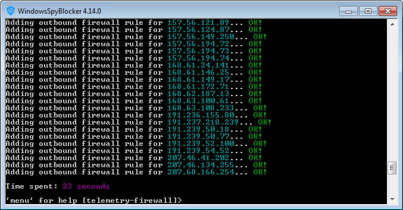
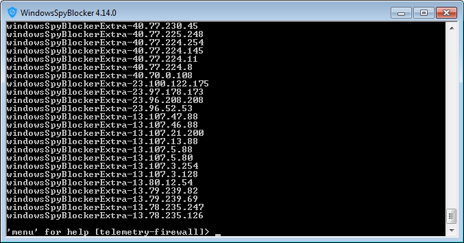

# Telemetry - Firewall

The WindowsSpyBlocker executable provides a tool to apply or remove network rules from your firewall:

To apply the WindowsSpyBlocker rules in your Windows firewall, launch `WindowsSpyBlocker.exe` and select `Firewall > Add spy rules`:

Here I choose **Add extra rules**. IPs are added in the Windows Firewall as outbound rules:

If you want you can display the current rules applied in your firewall (`Firewall > Display your current WindowsSpyBlocker rules`):

And remove them (`Firewall > Remove WindowsSpyBlocker rules`):

