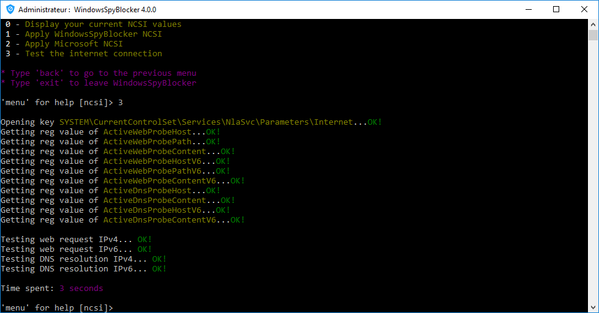

# Telemetry - NCSI

Windows check a Microsoft site for connectivity, using the Network Connectivity Status Indicator site. NCSI performs a DNS lookup on `www.msftncsi.com` and sends a DNS lookup request for `dns.msftncsi.com`.

You can block this probe by adding the content of the `data/<type>/extra.txt` hosts file.

But you will have a ["No Internet access" warning in your system tray](../../wiki/FAQ#no-internet-access-on-my-network-card).

To solve this problem you can use the alternative WindowsSpyBlocker NCSI by executing `WindowsSpyBlocker.exe` and select `NCSI > Apply WindowsSpyBlocker NCSI`:

Then you can test your internet connection the Microsoft way:

