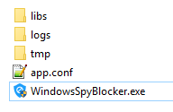
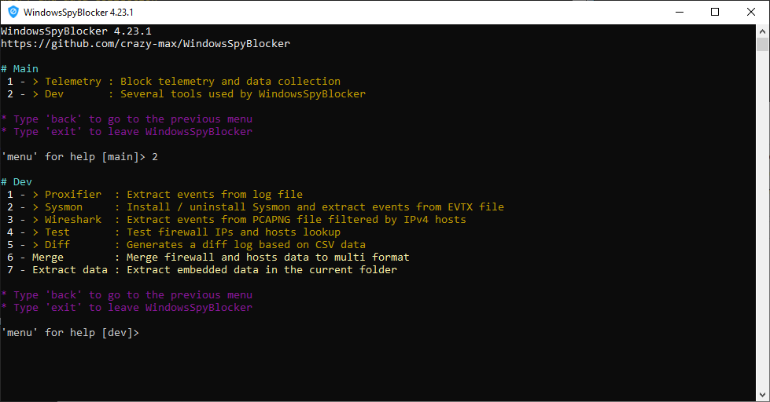

# Usage

* [Download](#download)
* [First launch](#first-launch)
* [Menu](#menu)
  * [Telemetry](#telemetry)
  * [Dev](#dev)
* [Data](#data)

## Download

* Directly from [GitHub releases](https://github.com/crazy-max/WindowsSpyBlocker/releases/latest)
* As a [Chocolate package](https://chocolatey.org/packages/windowsspyblocker) that will allow you to benefit from automatic updates

## First launch

When you execute WindowsSpyBlocker for the first time, a configuration file named `app.conf` is generated:

This configuration file is especially necessary for people who want to contribute to the project. See [dev](#dev) section.

## Menu

> Main window of WindowsSpyBlocker

### Telemetry

> Telemetry menu

Telemetry menu allows you to apply rules to the Windows firewall, to modify the NCSI and also to help contribute to the project!

* [Firewall](app/telemetry/firewall.md)
* [NCSI](app/telemetry/ncsi.md)

### Dev

> Dev menu

Dev menu mainly concerns developers or curious people who would like to contribute to WindowsSpyBlocker. Several applications are used by WindowsSpyBlocker to generate and capture traffic.

* QEMU
* [Proxifier](app/dev/proxifier.md)
* [Sysmon](app/dev/sysmon.md)
* [Wireshark](app/dev/wireshark.md)
* Test
* Diff
* Merge
* Extract data

## Data

[`data`](../data) folder contains blocking rules based on domains or IPs detected during the [capture process](how-it-works.md):

* `data/<type>/extra.txt` : Block third party applications (Skype, Bing, Live, Outlook, NCSI, etc.) (**:warning: ONLY use if you know what you do**)
* `data/<type>/spy.txt` : Block Windows Spy / Telemetry (**✅ recommended**)
* `data/<type>/update.txt` : Block Windows Update
* `data/hosts/[extra|spy|update]_v6.txt` : Handle IPv6 blocking for hosts

[`data/firewall`](data/firewall.md) and [`data/hosts`](data/hosts.md) data are the main types. Others are generated from these as:

* [DNSCrypt](data/dnscrypt.md) : a protocol for securing communications between a client and a DNS resolver.
* [OpenWrt](data/openwrt.md) : an open source project used on embedded devices to route network traffic.
* [P2P](data/p2p.md) : a plaintext IP data format from PeerGuardian.
* [Proxifier](data/proxifier.md) : an advanced proxy client on Windows with a flexible rule system.
* [simplewall](data/simplewall.md) : a simple tool to configure Windows Filtering Platform (WFP).
