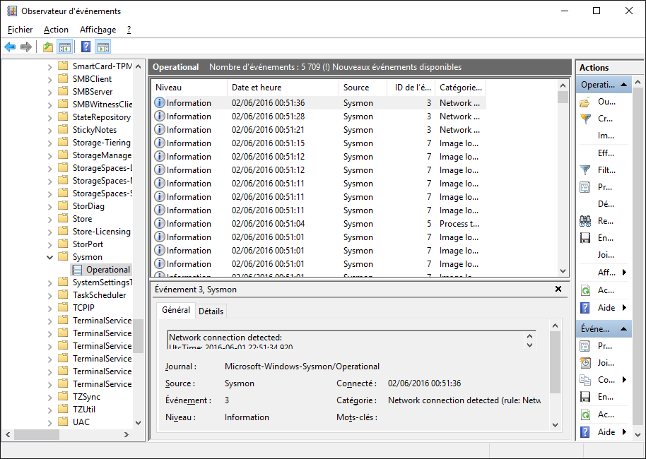

# Sysmon

!!! info
    [Sysmon](https://technet.microsoft.com/en-us/sysinternals/sysmon) is an advanced background monitor that records
    process-related activity to the event log.

## Capture

This application is available through the WindowsSpyBlocker executable. To install Sysmon, execute
`WindowsSpyBlocker.exe` and choose the `Install` option in `Dev > Sysmon`.

This installs Sysmon as a service that will survive reboots, collect network connection information, record MD5 hashes for all created processes, and record loading of modules.

Everything will be recorded in the Windows event log in `C:\Windows\System32\winevt\Logs\Microsoft-Windows-Sysmon%4Operational.evtx`.

You can see every events in the Event Viewer window through `Start > Run > eventvwr`:

## Parsing

WindowsSpyBlocker can be used to parse events and generate CSV files.

!!! warning
    Do not forget to edit the `app.conf` file before continuing
    
    * **sysmon**
        * **evtxPath**: Path to the event log.
    * **exclude**
        * **ips**: exclude IPs addresses from parsing. Ranges are allowed and in most cases you have to exclude your local network.
        * **hosts**: exclude domains from parsing. Wildcard are allowed and in most cases you have to exclude your local network.
        * **orgs**: exclude by whois organization from parsing. Wildcard are allowed and in most cases you have to exclude your ISP.

Launch `WindowsSpyBlocker.exe` and select `Dev > Sysmon > Extract log`:

CSV files will be generated in `logs/` folder:

* `sysmon-all.csv`
* `sysmon-hosts-count.csv`
* `sysmon-unique.csv`
