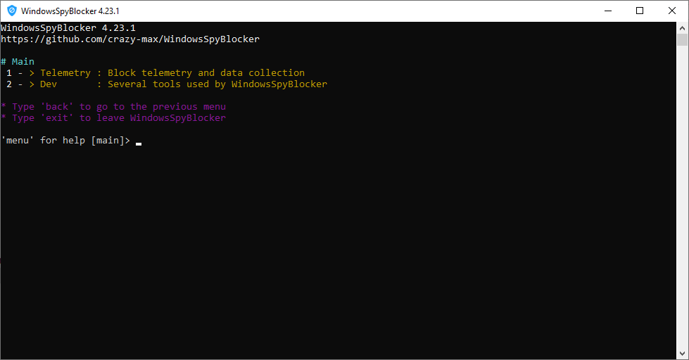

# Application

## First launch

When you execute WindowsSpyBlocker for the first time, a configuration file named `app.conf` is generated:

This configuration file is especially necessary for people who want to contribute to the project through
the [Dev menu](dev/index.md).

## Usage

The application currently consists of two menus:

* [**Telemetry** - _Block telemetry and data collection_](telemetry/index.md)
* [**Dev** - _Several tools used by WindowsSpyBlocker_](dev/index.md)

