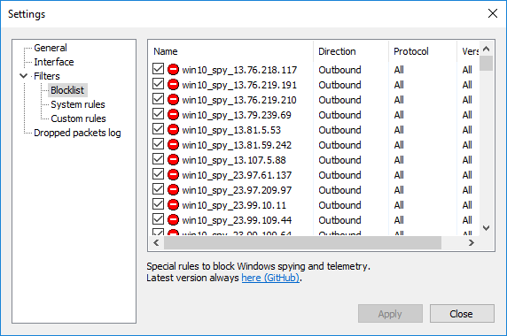

# simplewall

!!! info
    simplewall blocking rules available at [{{ config.repo_url }}tree/master/data/simplewall]({{ config.repo_url }}tree/master/data/simplewall)

[simplewall](https://github.com/henrypp/simplewall) is a simple tool to configure Windows Filtering Platform (WFP)
which can configure network activity on your computer.

This application is basically a firewall using by default the spy rules of WindowsSpyBlocker embedded in the
`blocklist.xml` file.

You can integrate data specifically generated for simplewall from `data/simplewall` by copying the `blocklist.xml` file to the
simplewall root folder.

Here is an example with the `blocklist.xml` from `data/simplewall/spy/blocklist.xml`:

