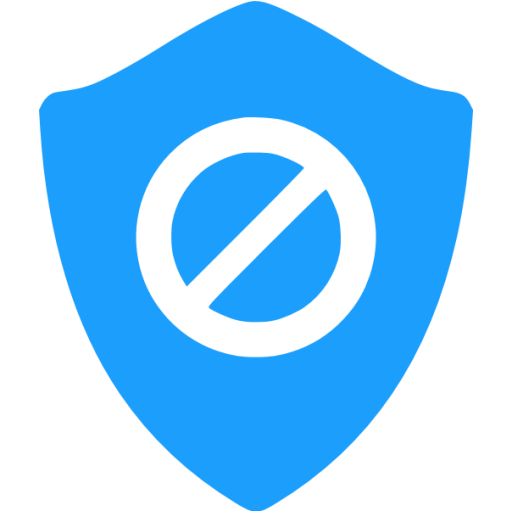

  
  
  
  
   
  
  

---

## What is WindowsSpyBlocker?

**WindowsSpyBlocker** :shield: is an application written in [Go](https://golang.org/) and delivered as a
[single executable]({{ config.repo_url }}releases/latest) to block spying and tracking on Windows systems.

The approach of this project is to capture and interpret network traffic based on a set of tools. Depending on the
interactions between services and source or destination of traffic, rules are created and sorted by assignment.

## Projects using WindowsSpyBlocker

* [BlackArch Linux](https://www.blackarch.org/): an Arch Linux-based penetration testing distribution for penetration testers and security researchers.
* [Blackweb](https://github.com/maravento/blackweb): URLs Blacklist for Squid.
* [BlahDNS](https://blahdns.com/): A small hobby ads block dns project with doh, dot, dnscrypt support.
* [DNSCrypt Proxy](https://dnscrypt.info/): A flexible DNS proxy, with support for encrypted DNS protocols.
* [Energized Protection](https://energized.pro/): Let's make an annoyance free, better open internet, altogether!
* [FilterLists](https://filterlists.com/): An independent, comprehensive directory of filter and host lists for advertisements, trackers, malware, and annoyances.
* [LEDE Project](https://lede-project.org/): A Linux operating system based on OpenWrt.
* [Mikrotik hosts parser](https://github.com/tarampampam/mikrotik-hosts-parser): An application that blocks "advertising" for routers based on RouterOS.
* [NextDNS](https://github.com/nextdns): Block ads, trackers, malware and phishing websites, cryptominers and more.  
* [OpenWrt adblock package](https://github.com/openwrt/packages/tree/master/net/adblock/files): DNS based ad/abuse domain blocking.
* [OPNsense](https://opnsense.org): An open source, easy-to-use and easy-to-build HardenedBSD based firewall and routing platform.
* [pi-hole](https://pi-hole.net/): A black hole for Internet advertisements (designed for Raspberry Pi).
* [privatezilla](https://github.com/builtbybel/privatezilla): Performs a privacy & security check of Windows 10.
* [simplewall](https://github.com/henrypp/simplewall): Simple tool to configure Windows Filtering Platform (WFP).
* [void-zones-tools](https://github.com/cyclaero/void-zones-tools): A list of void zones that can be readily feed into Unbound on FreeBSD.
* [WPD](https://getwpd.com/): Customize Group Policy, Services and Tasks, responsible for data collection and sending, as you like.

## License

This project is licensed under the terms of the MIT license.

Icon credit to [Icons8](https://icons8.com/).
